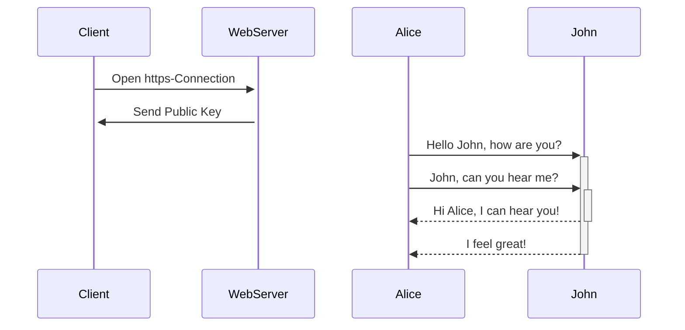

System Design & Architecture

# System Design & Architecture

* [Decoding Microservices: Best Practices for Developers](https://www.linkedin.com/posts/camunda_decoding-microservices-for-developers-activity-7095808664665473024-V0FK?utm_source=share&utm_medium=member_desktop)
* [HTTP Status Codes](https://www.linkedin.com/posts/brijpandeyji_understanding-http-status-codes-isnt-just-activity-7259415439405985793-oX7H?utm_source=share&utm_medium=member_desktop)
* [Load Balancers, Reverse Proxies, Forward Proxies, and API Gateways](https://www.linkedin.com/posts/rocky-bhatia-a4801010_load-balancers-reverse-proxies-forward-activity-7259527401053773824-XZbB?utm_source=share&utm_medium=member_desktop)
* [RabbitMQ vs Kafka vs ActiveMQ](https://www.linkedin.com/posts/brijpandeyji_%F0%9D%97%A8%F0%9D%97%BB%F0%9D%97%B1%F0%9D%97%B2%F0%9D%97%BF%F0%9D%98%80%F0%9D%98%81%F0%9D%97%AE%F0%9D%97%BB%F0%9D%97%B1%F0%9D%97%B6%F0%9D%97%BB%F0%9D%97%B4-%F0%9D%98%81%F0%9D%97%B5%F0%9D%97%B2-%F0%9D%97%A3%F0%9D%98%82%F0%9D%97%AF-activity-7257598212310552576-0y_7?utm_source=share&utm_medium=member_desktop)
* [OAuth2 OAuth Flow](https://www.linkedin.com/posts/curiouslearner_softwaredevelopment-activity-7257926830966329344-KKJf?utm_source=share&utm_medium=member_desktop)
* [6 Architecture Patterns to know](https://www.linkedin.com/posts/alexxubyte_systemdesign-coding-interviewtips-activity-7257435402221809666-1U22?utm_source=share&utm_medium=member_desktop)
* [System design is seeing the big picture](https://www.linkedin.com/posts/hamza-u-a04b9727a_systemdesign-scalability-reliability-activity-7257796936437575681-j4dS?utm_source=share&utm_medium=member_desktop)
* [8 Tips for Restful API Dsign](https://www.linkedin.com/posts/sahnlam_restful-api-design-tips-domain-model-activity-7257247111384059907-At_3?utm_source=share&utm_medium=member_desktop)
* [𝐀𝐩𝐩𝐥𝐢𝐜𝐚𝐭𝐢𝐨𝐧 𝐃𝐞𝐩𝐥𝐨𝐲𝐦𝐞𝐧𝐭 𝐨𝐧 𝐭𝐡𝐞 𝐊𝐮𝐛𝐞𝐫𝐧𝐞𝐭𝐞𝐬 𝐩𝐥𝐚𝐭𝐟𝐨𝐫𝐦 ❓](https://www.linkedin.com/posts/chandreshdesai_cloudcomputing-devops-kubernetes-activity-7257734217101406209-nLaz?utm_source=share&utm_medium=member_desktop)
* [Misc design tips](https://www.linkedin.com/posts/petarivanovv9_softwareengineering-programming-thetshapeddev-activity-7257655036019679234-3eTZ?utm_source=share&utm_medium=member_desktop)
* [𝐂𝐨𝐦𝐩𝐨𝐧𝐞𝐧𝐭𝐬 𝐨𝐟 𝐌𝐢𝐜𝐫𝐨𝐬𝐞𝐫𝐯𝐢𝐜𝐞𝐬 𝐀𝐫𝐜𝐡𝐢𝐭𝐞𝐜𝐭𝐮𝐫𝐞](https://www.linkedin.com/posts/adnan-maqbool-khan-0b4531a1_%F0%9D%90%82%F0%9D%90%A8%F0%9D%90%A6%F0%9D%90%A9%F0%9D%90%A8%F0%9D%90%A7%F0%9D%90%9E%F0%9D%90%A7%F0%9D%90%AD%F0%9D%90%AC-%F0%9D%90%A8%F0%9D%90%9F-%F0%9D%90%8C%F0%9D%90%A2%F0%9D%90%9C%F0%9D%90%AB%F0%9D%90%A8%F0%9D%90%AC%F0%9D%90%9E%F0%9D%90%AB%F0%9D%90%AF%F0%9D%90%A2%F0%9D%90%9C%F0%9D%90%9E%F0%9D%90%AC-activity-7255485170890297344-CwIH?utm_source=share&utm_medium=member_desktop)
* [𝐌𝐢𝐜𝐫𝐨𝐬𝐞𝐫𝐯𝐢𝐜𝐞𝐬 𝐚𝐫𝐜𝐡𝐢𝐭𝐞𝐜𝐭𝐮𝐫𝐚𝐥 𝐏𝐚𝐭𝐭𝐞𝐫𝐧 𝐌𝐢𝐧𝐝𝐌𝐚𝐩](https://www.linkedin.com/posts/rocky-bhatia-a4801010_%F0%9D%90%8C%F0%9D%90%A2%F0%9D%90%9C%F0%9D%90%AB%F0%9D%90%A8%F0%9D%90%AC%F0%9D%90%9E%F0%9D%90%AB%F0%9D%90%AF%F0%9D%90%A2%F0%9D%90%9C%F0%9D%90%9E%F0%9D%90%AC-%F0%9D%90%9A%F0%9D%90%AB%F0%9D%90%9C%F0%9D%90%A1%F0%9D%90%A2%F0%9D%90%AD%F0%9D%90%9E-activity-7257715505807904769-gMuB?utm_source=share&utm_medium=member_desktop)
* https://www.linkedin.com/posts/nk-systemdesign-one_how-to-master-system-design-in-1-month-or-activity-7257021037270200322-zgrs?utm_source=share&utm_medium=member_desktop
* 1/ How YouTube Was Able to Support 2.49 Billion Users With MySQL:
↳ https://lnkd.in/efmJw4Dx

2/ How Amazon S3 Achieves 99.999999999% Durability:
↳ https://lnkd.in/eutGiK35

3/ How Stripe Prevents Double Payment Using Idempotent API:
↳ https://lnkd.in/erMkqwq4

4/ How Amazon Lambda Works:
↳ https://lnkd.in/eNd3Z5Yn

5/ How Uber Finds Nearby Drivers at 1 Million Requests per Second:
↳ https://lnkd.in/eeqH9Hjh

6/ How PayPal Was Able to Support a Billion Transactions per Day With Only 8 Virtual Machines:
↳ https://lnkd.in/eqcb7MpP

7/ How Uber Computes ETA at Half a Million Requests per Second:
↳ https://lnkd.in/eVKV2ePC

8/ How WhatsApp Was Able to Support 50 Billion Messages a Day With Only 32 Engineers:
↳ https://lnkd.in/gRqBgXfc

9/ How Google Search Works:
↳ https://lnkd.in/eAiQqnwd

10/ How Cloudflare Was Able to Support 55 Million Requests per Second With Only 15 Postgres Clusters:
↳ https://lnkd.in/eEQP6Apw

11/ How Tinder Scaled to 1.6 Billion Swipes per Day:
↳ https://lnkd.in/en65fv-W

12/ How Amazon S3 Works:
↳ https://lnkd.in/e2p7qXri

13/ How Facebook Was Able to Support a Billion Users via Software Load Balancer:
↳ https://lnkd.in/egxWtYHT

14/ How Meta Achieves 99.99999999% Cache Consistency:
↳ https://lnkd.in/e88kUZAm

1. Learn how relational databases query data

2. Learn how and when to use read replicas

3. Learn how and when to use sharding and how to choose partition keys

* [18 Brutal career truths](https://www.linkedin.com/posts/adamgraham_18-brutal-career-truths-ugcPost-7257015140020035584-_-Js?utm_source=share&utm_medium=member_desktop)

  ## Messaging

  ### Kafka
  [𝗞𝗲𝘆 𝗞𝗮𝗳𝗸𝗮 𝗖𝗼𝗺𝗽𝗼𝗻𝗲𝗻𝘁𝘀 𝗘𝘅𝗽𝗹𝗮𝗶𝗻𝗲𝗱](https://www.linkedin.com/posts/brijpandeyji_kafka-is-an-open-source-distributed-streaming-activity-7258077837633503232-XE22?utm_source=share&utm_medium=member_desktop)
  Kafka is an open-source, distributed streaming platform designed to store, manage, and process real-time data feeds. It acts as a central hub for streaming data, enabling different systems to publish and consume data seamlessly. It’s widely used for building data pipelines, integrating systems, and processing data at scale.

#### 𝗞𝗲𝘆 𝗞𝗮𝗳𝗸𝗮 𝗖𝗼𝗺𝗽𝗼𝗻𝗲𝗻𝘁𝘀 𝗘𝘅𝗽𝗹𝗮𝗶𝗻𝗲𝗱

1. Producer 
 - Producers are responsible for creating and sending data (known as “messages”) to Kafka topics. They serialize messages and group them into partitions to ensure efficient data distribution.
 - Each message contains key-value pairs, which are assigned to partitions within a topic.
 - The producer connects to brokers and decides which partition each message should go to, allowing data to be distributed and processed in parallel.

2. Broker 
 - Brokers are Kafka servers that manage the storage and retrieval of data. They act as intermediaries between producers and consumers, handling data ingestion and replication.
 - Kafka brokers are part of a Kafka cluster and maintain the health and availability of data by replicating partitions across multiple brokers.
 - Each partition has a leader broker and several replicas on other brokers, providing redundancy and fault tolerance in case of a failure.

3. Topic and Partitions 
 - Topics are categories or channels where messages are stored and organized. Each topic is split into partitions, which allow data to be distributed across multiple brokers for parallel processing.
 - Partitions play a crucial role in Kafka’s scalability, enabling large volumes of data to be processed simultaneously.
 - Each topic can have multiple partitions, ensuring that messages are balanced across consumers for optimal performance.

4. Consumer 
 - Consumers read data from Kafka topics. They are part of consumer groups, which allow multiple consumers to read from the same topic, with each partition assigned to only one consumer in the group.
 - This setup ensures that data is processed only once within a group, supporting efficient load balancing and enabling applications to scale by adding more consumers to the group.

5. Kafka Cluster and Replication 
 - A Kafka cluster consists of multiple brokers, working together to handle high volumes of data. Replication is key to Kafka’s reliability, with data replicated across brokers for durability.
 - If a broker fails, another replica can take over, ensuring data consistency and availability. This makes Kafka a robust solution for applications requiring high availability.

𝗞𝗮𝗳𝗸𝗮 𝗶𝘀 𝗶𝗱𝗲𝗮𝗹 𝗳𝗼𝗿:
- Real-time data streaming in applications like log aggregation, event tracking, and user activity monitoring.
- Building data pipelines to move data between systems reliably and at scale.
- Fault tolerance and scalability, making it suitable for distributed systems where resilience is critical.

## HTTPS Encryption
[𝗨𝗻𝗱𝗲𝗿𝘀𝘁𝗮𝗻𝗱𝗶𝗻𝗴 𝗛𝗧𝗧𝗣𝗦 𝗘𝗻𝗰𝗿𝘆𝗽𝘁𝗶𝗼𝗻: 𝗔 𝗦𝘁𝗲𝗽-𝗯𝘆-𝗦𝘁𝗲𝗽 𝗣𝗿𝗼𝗰𝗲𝘀𝘀 ](https://www.linkedin.com/posts/brijpandeyji_%F0%9D%97%A8%F0%9D%97%BB%F0%9D%97%B1%F0%9D%97%B2%F0%9D%97%BF%F0%9D%98%80%F0%9D%98%81%F0%9D%97%AE%F0%9D%97%BB%F0%9D%97%B1%F0%9D%97%B6%F0%9D%97%BB%F0%9D%97%B4-%F0%9D%97%9B%F0%9D%97%A7%F0%9D%97%A7%F0%9D%97%A3%F0%9D%97%A6-%F0%9D%97%98%F0%9D%97%BB%F0%9D%97%B0%F0%9D%97%BF%F0%9D%98%86%F0%9D%97%BD%F0%9D%98%81%F0%9D%97%B6%F0%9D%97%BC%F0%9D%97%BB-activity-7258478623223902209-NTQQ?utm_source=share&utm_medium=member_desktop)

id: 5d87ebe6d40141fe8605ea5ca1c05e00
parent_id: 1ea2f3ad3e9a423088c64cbd95e289c2
created_time: 2024-10-29T17:43:18.280Z
updated_time: 2024-11-06T22:40:25.409Z
is_conflict: 0
latitude: 50.11092210
longitude: 8.68212670
altitude: 0.0000
author: 
source_url: 
is_todo: 0
todo_due: 0
todo_completed: 0
source: joplin-desktop
source_application: net.cozic.joplin-desktop
application_data: 
order: 13522912007.578125
user_created_time: 2024-10-29T17:43:18.280Z
user_updated_time: 2024-11-05T21:13:17.791Z
encryption_cipher_text: 
encryption_applied: 0
markup_language: 1
is_shared: 0
share_id: 
conflict_original_id: 
master_key_id: 
user_data: 
deleted_time: 0
type_: 1